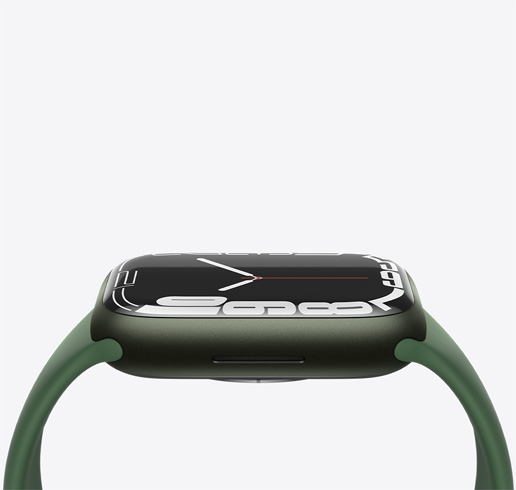

<!DOCTYPE html>
<html lang="en">
<head>
    <link rel="stylesheet" type="text/css" href="Apple.css">
    <link rel="icon" type="image/x-icon" href="apple (2).png">
    <meta charset="UTF-8">
    <meta http-equiv="X-UA-Compatible" content="IE=edge">
    <meta name="viewport" content="width=device-width, initial-scale=1.0">
    <title>Apple</title>
</head>
<body>
    

        
        <a href="#" style="color: rgb(192, 189, 189)">Store</a>
        <a href="#" style="color: rgb(192, 189, 189)">Mac</a>
        <a href="#" style="color: rgb(192, 189, 189)">iPad</a>
        <a href="#" style="color: rgb(192, 189, 189)">iPhone</a>
        <a href="#" style="color: rgb(192, 189, 189)">Watch</a>
        <a href="#" style="color: rgb(192, 189, 189)">AirPods</a>
        <a href="#" style="color: rgb(192, 189, 189)">TV & Home</a>
        <a href="#" style="color: rgb(192, 189, 189)">Only on Apple</a>
        <a href="#" style="color: rgb(192, 189, 189)">Accessories</a>
        <a href="#" style="color: rgb(192, 189, 189)">Support</a>
        
        
    

    

        
 Shop now at the Apple Store online with many great ways to buy. Get free, no-contact delivery, Specialist help and<a href="#" style="color: rgb(0, 132, 255)"> more ></a>
 
    

    

        

            
        

        

            <h1> iPhone 13 Pro </h1>
            <h5> Oh.So.Pro </h5>
        

    

    

        

            
        

        

            <h1> iPhone 13 </h1>
            <h5> Your new superpower. </h5>
        

    

    

        

            
        

        

            <h1> MacBook Pro </h1>
            <h5> Supercharged for pros. </h5>
        

    

    

        

            

                
            

            

                <h2> Watch </h2>
                
 SERIES 7 

                <h5> Introducing our largest display yet. </h5>
            

        

        

            

                
            

            

                <h1> iPad </h1>
 mini 

                <h5>Mega power. Mini sized.</h5>
            

        

    

    

        

            

                
            

            

                <h1> Airpods </h1>
                <h5> All-new with spatial audio. </h5>
            

        

        

            

                
            

            

                <h1>HomePod mini</h1>
                <h5>Yellow, orange and blue available in late November.</h5>
            

        

    

    

        

            

                
            

            

                <h1>Arcade</h1>
                <h5>Get 3 months free when you buy  an new iPhone, iPad, iPod touch,  Apple TV or Mac.</h5>
            

        

        

            

                
            

            

                <h5>tv+</h5>
                <h1>FINCH</h1>
            

        

    

</body>
</html>
